# ML Service — Phishing Detection

Microservice exposing two independent XGBoost classifiers via FastAPI:
one for **URL phishing detection** and one for **email phishing detection**.
Both models support Polish and English content and are designed to run inside Docker
with a cold-start time under 5 seconds.

## Table of Contents

- [Architecture Overview](#architecture-overview)
- [URL Phishing Detection](#url-phishing-detection)
  - [Dataset](#dataset)
  - [Feature Engineering](#feature-engineering----srcurl_modelpreprocesspy)
  - [Model](#model----srcurl_modeltrainpy)
  - [Results](#results)
  - [Evaluation Plots](#evaluation-plots)
- [Email Phishing Detection](#email-phishing-detection)
  - [Dataset](#dataset-1)
  - [Feature Engineering](#feature-engineering----srcemail_modelpreprocesspy)
  - [Why Not Word Embeddings?](#why-not-word-embeddings)
  - [Model](#model----srcemail_modeltrainpy)
  - [Results](#results-1)
  - [Evaluation Plots](#evaluation-plots-1)
- [Inference API](#inference-api----app)
- [Project Structure](#project-structure)
- [⚠️ Limitations — Why the Reported Metrics Are Optimistic](#️-limitations--why-the-reported-metrics-are-optimistic)
- [Regenerating Plots](#regenerating-plots)
- [Retraining](#retraining)

---

## Architecture Overview

```
mobile app
    │
    ▼
API Gateway  (FastAPI, port 8080)
    │  /check-url
    │  /check-mail
    ▼
ML Service   (FastAPI, port 8000)
    ├── URLPredictor   ← src/url_model/
    └── EmailPredictor ← src/email_model/
```

Each predictor loads its model once at startup and serves synchronous predictions.
A **trusted-domain bypass** is applied before the model runs — requests from known
legitimate domains (Google, GitHub, Allegro, Polish banks, etc.) are short-circuited
with `confidence: 0.99` to avoid false positives on well-known senders.

---

## URL Phishing Detection

### Dataset

| | |
|---|---|
| Source | `phishing_site_urls.csv` + Tranco top-1M legitimate URLs |
| Size | **749 346 URLs** (592 924 legit / 156 422 phishing) |
| Split | 80 / 20 train-test, stratified |

### Feature Engineering — `src/url_model/preprocess.py`

All features are derived purely from the URL string — no HTTP requests are made
at inference time, which keeps prediction latency under 10 ms.

| Group | Features |
|---|---|
| **Length** | `url_length`, `domain_length`, `path_length`, `registrable_domain_length` |
| **Structure** | `subdomain_count`, `path_depth`, `query_param_count`, `dot_count`, `dash_count` |
| **Character stats** | `digit_ratio`, `special_char_count`, `has_at_symbol`, `has_hex_encoding` |
| **Entropy** | `url_entropy`, `domain_entropy`, `path_entropy`, `tld_entropy` |
| **Suspicious patterns** | `suspicious_tld`, `suspicious_words`, `is_ip_address`, `has_multiple_http`, `is_shortened_url` |
| **Brand similarity** | `levenshtein_to_brand`, `brand_in_subdomain` — Levenshtein distance to the top-50 brand names to catch typosquatting |
| **Token analysis** | `domain_tokens_count`, `suspicious_tokens`, `registrable_domain_is_numeric` |

**Total: 32 features**

### Model — `src/url_model/train.py`

**XGBoost binary classifier** with threshold optimised on the precision-recall curve.

```
n_estimators=500, max_depth=7, learning_rate=0.05
subsample=0.85, colsample_bytree=0.85
scale_pos_weight=3.79  (class imbalance correction)
eval_metric=aucpr
```

The decision threshold is set to the point that maximises F1 on the test set
rather than using the default 0.5, which would be inappropriate given the
~1:3.8 phishing-to-legitimate imbalance.

### Results

| Metric | Score |
|---|---|
| Accuracy | 0.9533 |
| Precision | 0.8985 |
| Recall | 0.8752 |
| **F1** | **0.8867** |
| **ROC-AUC** | **0.9860** |
| Optimal threshold | 0.6984 |

### Evaluation Plots

| | |
|---|---|
| 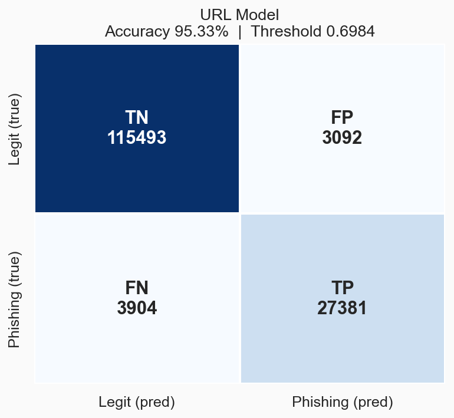 | 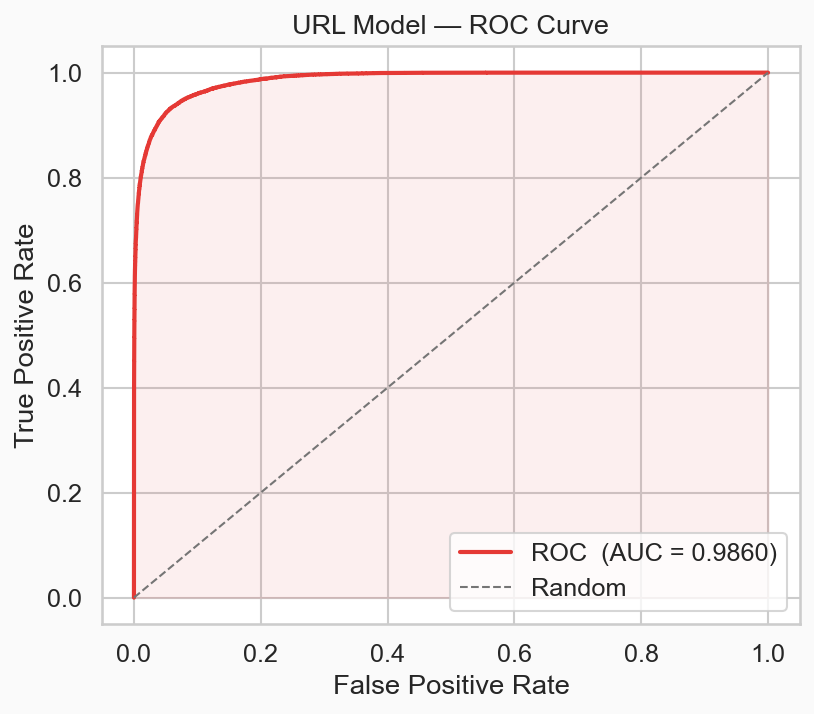 |
| 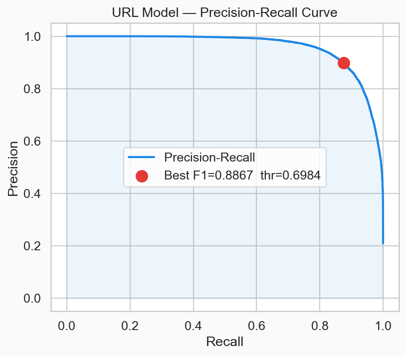 | 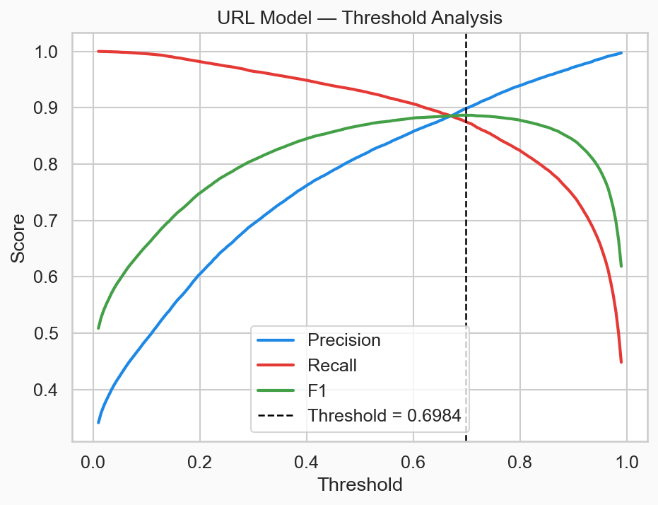 |
| 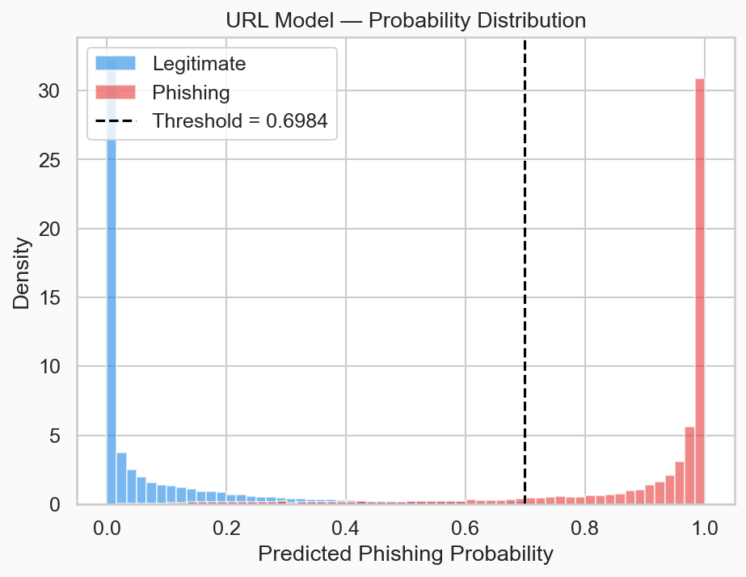 | 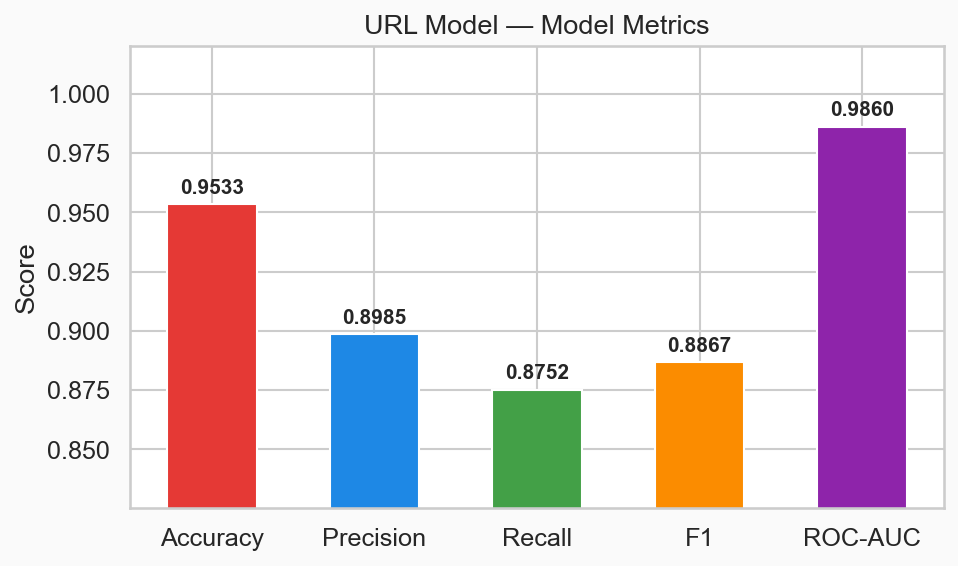 |

**Feature importance** (top 25 features by XGBoost gain):

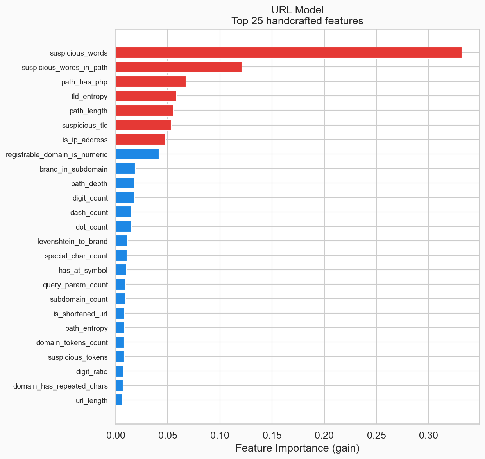

The most discriminative features are `url_entropy`, `levenshtein_to_brand`,
`brand_in_subdomain`, and `suspicious_tld` — consistent with how phishing URLs
are constructed in the wild (typosquatting, random-looking domains, abuse of
free TLDs).

---

## Email Phishing Detection

### Dataset

| | |
|---|---|
| Sources | CEAS\_08 (mailing list dataset) + Enron spam corpus (Kaggle) |
| Size | **72 878 emails** (39 021 phishing / 33 857 legitimate) |
| Languages | English and Polish |
| Split | 80 / 20 train-test, stratified |

The CEAS\_08 legitimate set consists primarily of developer mailing lists, which
introduced a strong dataset bias (long, technical emails ↔ legitimate).
The Enron corpus was added to provide diverse business email content and reduce
that bias. Subject lines were also stripped of `Re:` / `Fwd:` prefixes, which
were artefacts of the CEAS\_08 threading format leaking into the model.

### Feature Engineering — `src/email_model/preprocess.py`

Two complementary feature groups are combined:

#### 1. Handcrafted structural features (31 features)

| Group | Features |
|---|---|
| **Sender domain** | `sender_is_free_email`, `sender_domain_length`, `sender_domain_has_digits`, `sender_suspicious_tld`, `sender_subdomain_count`, `sender_domain_entropy` |
| **Subject line** | `subject_length`, `subject_urgency_words`, `subject_phishing_keywords`, `subject_uppercase_ratio`, `subject_exclamation_count`, `subject_question_count`, `subject_entropy` |
| **Body** | `body_length`, `body_word_count`, `body_is_html`, `body_html_tag_count`, `body_url_count`, `body_ip_url_count`, `body_urgency_count`, `body_phishing_keyword_count`, `body_avg_word_length`, `body_uppercase_ratio`, `body_digit_ratio`, `body_entropy` |
| **URLs** | `has_urls`, `url_count`, `url_has_ip` |

Urgency keywords and phishing vocabulary are defined in both **English and Polish**
(e.g. `pilne`, `zweryfikuj`, `nagroda`, `przelew`) so the model handles
Polish-language phishing without relying on translation.

#### 2. TF-IDF character n-gram features (300 features)

```python
TfidfVectorizer(
    analyzer='char_wb',
    ngram_range=(3, 5),
    max_features=300,
    min_df=3,
    max_df=0.95,
    sublinear_tf=True,
)
```

Character n-grams (`analyzer='char_wb'`) are inherently **language-agnostic**:
they capture morphological fragments, spelling patterns, and character sequences
that correlate with phishing regardless of the language. A model trained on
3–5 character slices of text generalises across Polish, English, and mixed-language
emails without requiring separate language detection or translation.

**Total: 331 features** (31 handcrafted + 300 TF-IDF)

### Why Not Word Embeddings?

Word embeddings (FastText, sentence-transformers) were evaluated as an alternative
to TF-IDF. The FastText pretrained models for Polish (`cc.pl.300.bin`) and English
(`cc.en.300.bin`) were downloaded and tested.

**The approach was abandoned** for the following reason:

> Each FastText pretrained model is **6.7 GB on disk** due to the subword hash table
> (2 million buckets × 300 dimensions). Vocabulary reduction does not meaningfully
> reduce this size because the bulk of the file is the subword character n-gram table,
> not the word vectors. Loading both models in Docker exhausted the container memory
> limit and crashed the service (`exit code 0`, OOM).

Character n-gram TF-IDF achieves comparable language coverage at a fraction of the
cost: the fitted vectorizer is **~4 MB** and loads in milliseconds. Given that
the final model reaches F1 = 0.9845 and ROC-AUC = 0.9987, the trade-off clearly
favours the lightweight approach.

### Model — `src/email_model/train.py`

**XGBoost binary classifier** with the same architecture as the URL model.

```
n_estimators=500, max_depth=8, learning_rate=0.05
min_child_weight=3, gamma=0.1
subsample=0.85, colsample_bytree=0.85
reg_alpha=0.3, reg_lambda=1.5
scale_pos_weight=1.15  (mild class imbalance correction)
eval_metric=aucpr
```

### Results

| Metric | Score |
|---|---|
| Accuracy | 0.9833 |
| Precision | 0.9807 |
| Recall | 0.9883 |
| **F1** | **0.9845** |
| **ROC-AUC** | **0.9987** |
| Optimal threshold | 0.4562 |

### Evaluation Plots

| | |
|---|---|
| 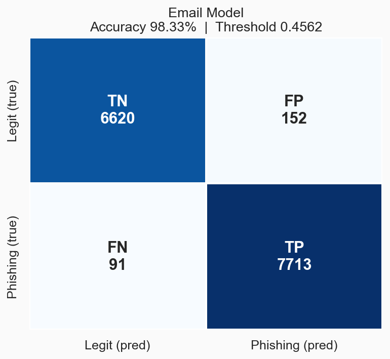 | 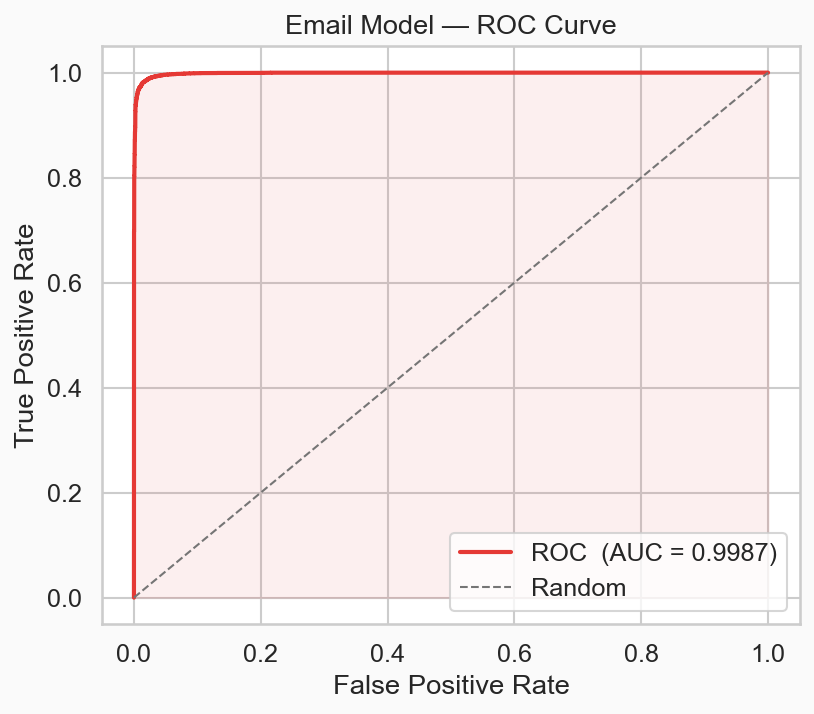 |
| 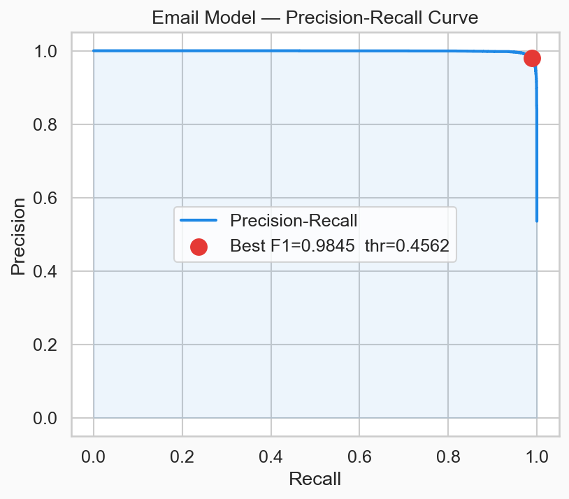 | 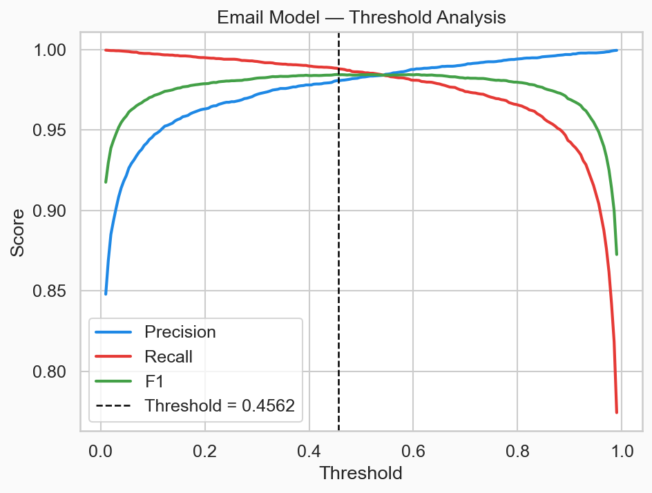 |
| 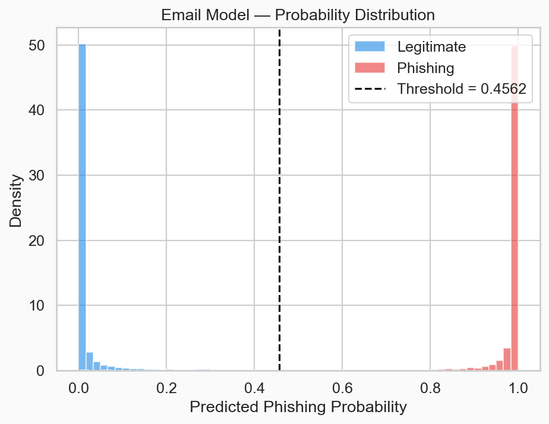 | 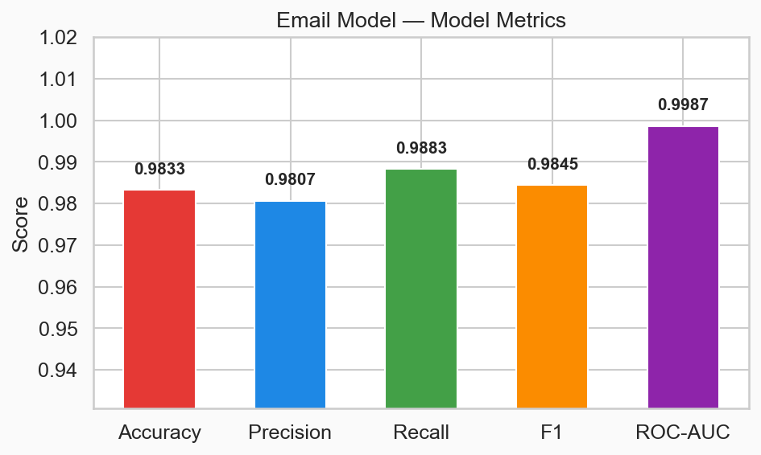 |

**Handcrafted feature importance** (TF-IDF features excluded for clarity):

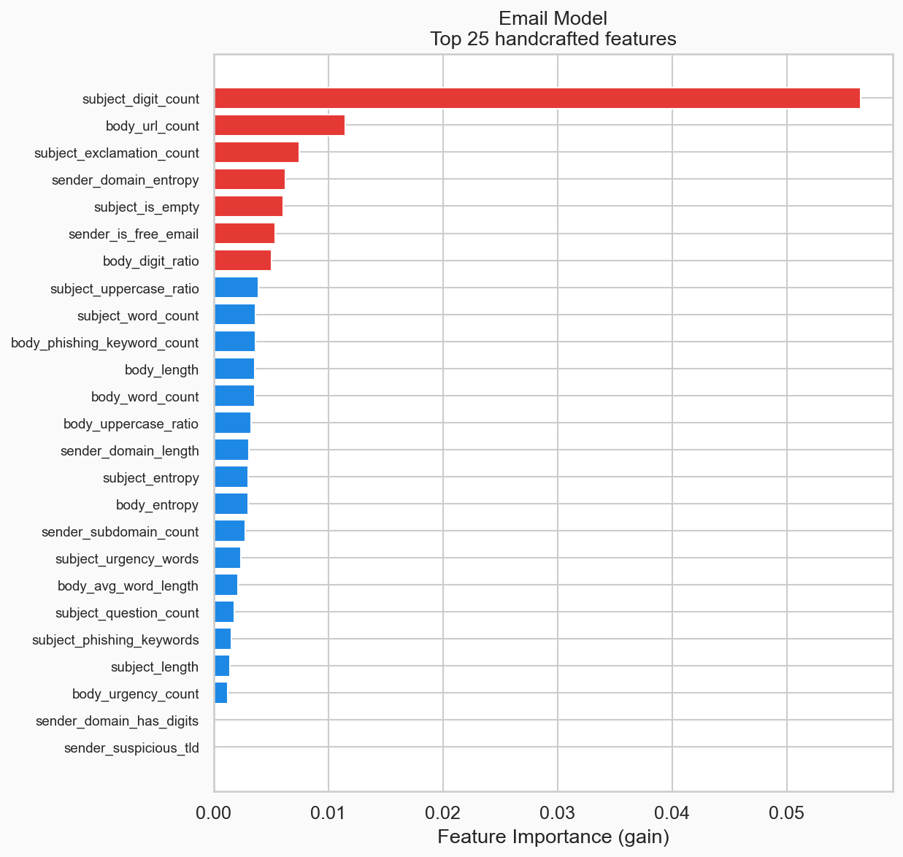

**Top TF-IDF character n-grams by importance:**

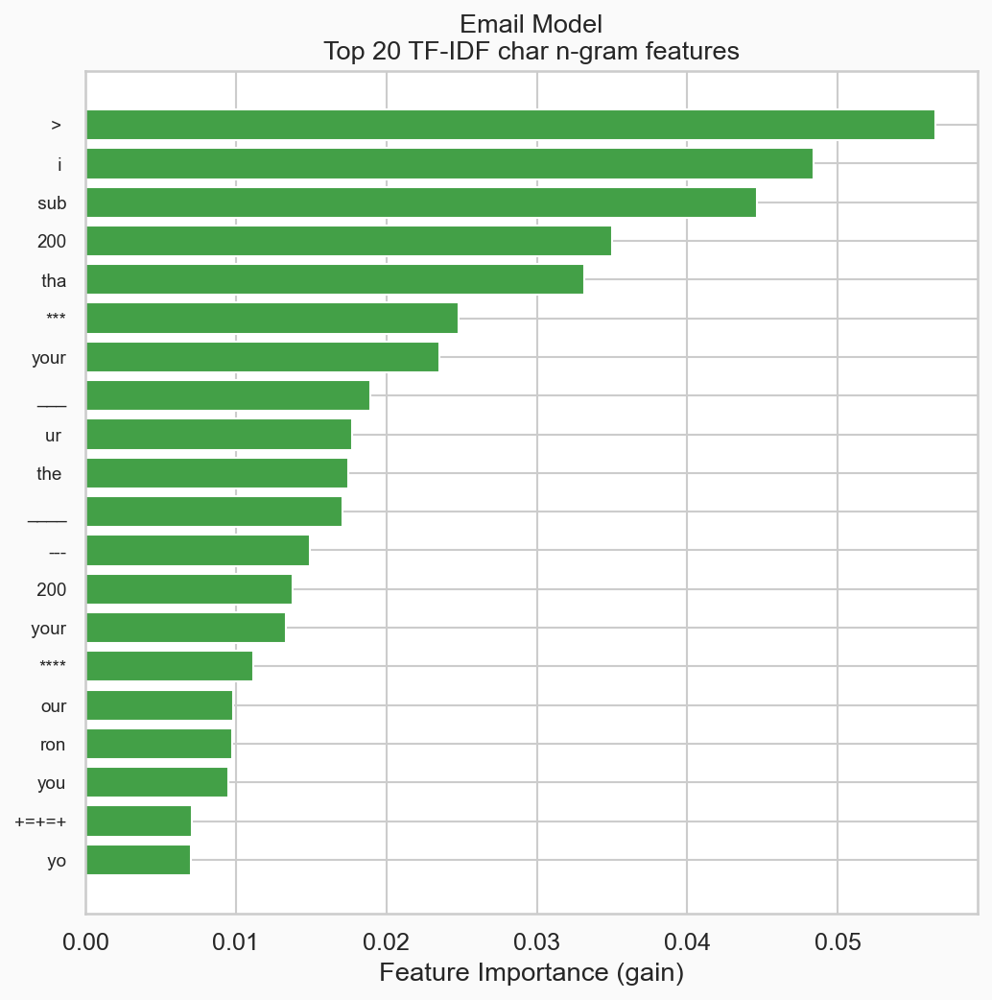

The probability distribution plot shows a strong bimodal separation: most emails
receive a probability close to 0 or close to 1, meaning the model is confident
in the vast majority of predictions. The grey zone around the threshold is narrow,
which is why the `uncertain` flag (returned when `|p − 0.5| < 0.15`) rarely
triggers in practice.

---

## Inference API — `app/`

### Endpoints

```
POST /predict/url   { "input": "https://example.com" }
POST /predict/mail  { "subject": "...", "body": "...", "sender": "...", "urls": "..." }
GET  /health
```

### Response format

```json
{
  "is_phishing": false,
  "confidence": 0.9731,
  "uncertain": false,
  "threshold": 0.4562,
  "trusted_sender": false
}
```

| Field | Description |
|---|---|
| `is_phishing` | `true` when predicted probability ≥ threshold |
| `confidence` | certainty of the prediction: `p` if phishing, `1 − p` if legitimate |
| `uncertain` | `true` when `\|p − 0.5\| < 0.15` — model is in the grey zone |
| `trusted_sender` | `true` when the domain was matched against the trusted-domain whitelist and ML was bypassed |

### Predictor — `app/predictor.py`

`URLPredictor` and `EmailPredictor` are loaded once at startup via `joblib.load`.
`EmailPredictor` also loads the fitted TF-IDF vectorizer and applies it at inference
time with `tfidf.transform([text])`. Both classes apply the trusted-domain bypass
before running the classifier.

---

## Project Structure

```
ml-service/
├── app/
│   ├── main.py          # FastAPI routes
│   └── predictor.py     # URLPredictor, EmailPredictor
├── src/
│   ├── url_model/
│   │   ├── preprocess.py   # URL feature extraction
│   │   ├── train.py        # XGBoost training pipeline
│   │   ├── prepare_data.py # Raw data → processed CSV
│   │   └── models/         # phishing_detector.joblib, features.txt, metadata.json
│   └── email_model/
│       ├── preprocess.py   # Email feature extraction + TF-IDF fitting
│       ├── train.py        # XGBoost training pipeline
│       └── models/         # email_phishing_detector.joblib, features.txt, metadata.json
├── data/
│   ├── urls/
│   │   ├── raw/            # phishing_site_urls.csv, top-1m.csv
│   │   └── processed/      # phishing_urls_processed.csv
│   └── emails/
│       ├── raw/            # CEAS_08.csv, enron_spam_data.csv
│       └── processed/      # emails_processed.csv, tfidf_vectorizer.joblib
├── plots/
│   ├── url/                # 7 evaluation plots
│   └── email/              # 8 evaluation plots
├── src/visualize.py        # Regenerate all plots from saved models
├── Dockerfile
└── requirements.txt
```

## ⚠️ Limitations — Why the Reported Metrics Are Optimistic

The numbers above (F1 = 0.9845, ROC-AUC = 0.9987 for email; F1 = 0.8867, ROC-AUC = 0.9860 for URL)
look strong, but they come with important caveats that make them **not fully representative
of real-world performance**.

### 1. Train and test data come from the same distribution

Both models are evaluated on a held-out split of the **same static datasets** they were
trained on. This means the test set reflects the same time period, the same sources,
and the same formatting conventions as the training data. It tells us how well the model
memorised the patterns in those specific files — not how well it generalises to emails
and URLs it has never seen.

A model evaluated this way will almost always report higher scores than it deserves.
A proper evaluation would require a **temporally separated test set**: data collected
after the training cut-off, from real user traffic.

### 2. Dataset artifacts inflate the email model score

The CEAS\_08 dataset — which makes up a significant portion of the legitimate email
class — consists almost entirely of **developer mailing lists** (Apache, Python, Linux
kernel, etc.). These are structurally very different from typical consumer email:
they are long, contain code blocks, have plain-text bodies, and lack urgency language.

As a result, the model partially learned a proxy rule: *long, technical, plain-text
email → legitimate*. This inflates recall on the legitimate class within the test set,
but will produce **false negatives** on real sophisticated phishing that mimics
professional communication style.

The Enron corpus was added specifically to dilute this bias, but it does not fully
eliminate it — Enron emails are also professional business communication and do not
represent the diversity of a real consumer inbox.

### 3. Phishing evolves; static models decay

Phishing techniques change continuously. New URL obfuscation patterns emerge,
new brand impersonation targets appear, and adversarial actors actively probe
and adapt to detection systems. A model trained on a fixed snapshot of data
**degrades in accuracy over time** as the real-world distribution drifts away
from the training distribution. Neither model has been evaluated on data from
2024–2025.

### 4. Class imbalance in the URL dataset

The URL dataset is heavily skewed (592 924 legitimate vs 156 422 phishing, ~3.8:1).
`scale_pos_weight` corrects for this during training, but the high overall accuracy
is partly driven by the dominant legitimate class — a model that predicted "legitimate"
for everything would still achieve ~79% accuracy. The F1 score is a better indicator
here, and at 0.8867 it reflects real misclassifications.

### 5. No adversarial evaluation

Neither model has been tested against adversarially crafted inputs — URLs or emails
specifically designed to evade detection (e.g. homoglyph attacks, padding with
legitimate-looking text, using trusted CDN subdomains to host payloads). Production
phishing increasingly uses such techniques.

---

### What would good evaluation look like in the future?

| What | Why |
|---|---|
| Temporally separated test set (data from 2024+) | Measures generalisation, not memorisation |
| Real user feedback loop (confirmed FP/FN reports) | Ground truth from production traffic |
| Adversarial test suite | Robustness against evasion |
| Regular retraining schedule (e.g. quarterly) | Keeps up with evolving phishing patterns |
| Diverse legitimate email corpus (consumer, not just developer lists) | Reduces dataset bias in the email model |
| Multilingual test sets (Polish, English, mixed) | Validates language-agnostic claims |

The current models are a **solid baseline** suitable for a v1 production deployment,
but should not be treated as final. Retraining on fresher and more diverse data is
the single highest-impact improvement available.

---

## Regenerating Plots

```bash
cd ml-service
python3.11 src/visualize.py
# plots saved to ml-service/plots/
```

## Retraining

```bash
# URL model
python3.11 src/url_model/prepare_data.py   # raw → processed CSV
python3.11 src/url_model/train.py

# Email model
python3.11 src/email_model/preprocess.py   # raw CSVs → processed CSV + vectorizer
python3.11 src/email_model/train.py
```
